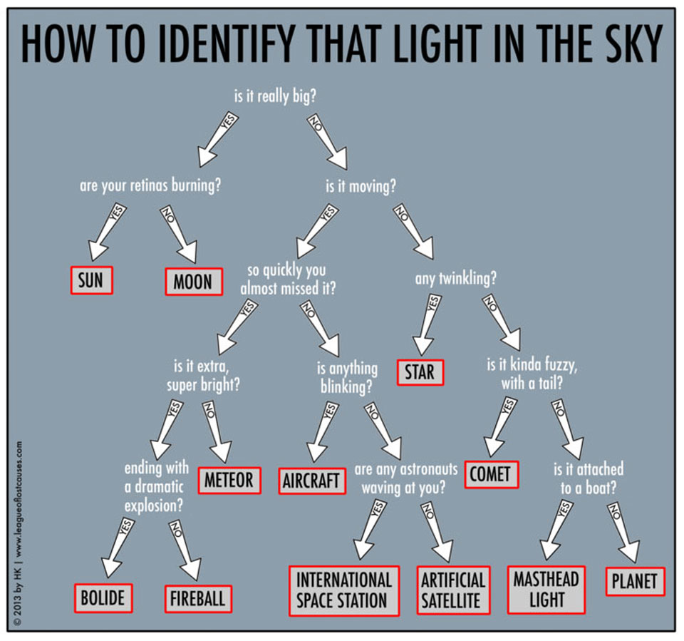

# lucy
### Luces en el firmamento
> Implementación del proceso identificador de cuerpos brillantes en el cielo.

<!-- Estilos para texto plano -->
En la tarea Entrega tu código hay un descriptor de un nuevo asunto.

### Introducción:
En toda operación de mantenimiento correctivo hay que realizar un proceso investigador que concluya con el diagnóstico de la avería. Normalmente se estudian los casos y se establece un árbol de toma de decisiones que minimice costes, tiempo, esfuerzo. Tu labor consiste en codificar un programa asistente y verificar su corrección.

### Objetivos:
- Tratar las instrucciones condicional y selectiva del lenguaje
- Aplicar una interfaz multilíngüe al programa
- Verificar la corrección del algoritmo de forma sistemática
- Poner en Kubuntu un fondo de pantalla cambiante
- Aprender fundamentos sobre astronomía

### Procedimiento:
Estudia el capítulo sobre "condicionales" de los apuntes C#.
Instala, configura y utiliza Geany u otro entorno de compilación.
En su defecto, ejecuta directamente el compilador csc.exe desde la línea de comandos.

Basándote en la "Imagen Astronómica del Día" 14 noviembre 2021, en la que aparece la infografía (c)2013 by Holly Kohler, publicada en 2013 en La liga de las causas perdidas, escribe un programa C# para la consola que:
- pida el idioma ENG / ESP / VAL / FRA /ITA de las preguntas (ver traducciones)
- debas responder como Y/N, S/N, O/N, etc, según el idioma elegido (también la respuesta larga, mayúscula o minúscula)
- lance la pregunta correspondiente a cada nivel según el árbol representado en la infografía
- Bifurque a la siguiente según la respuesta
- Resuelva indicando de qué objeto celeste se trata en base a tus respuestas
- Si el programa se llama con argumentos, éstos serán las respuestas que ha de dar el usuario (separadas por espacio)
Además:
- Elaborar una batería de pruebas para comprobar el correcto funcionamiento .bat (fácil), o test unitario (más fácil pero avanzado).
- Poner en tu sistema, como fondo de pantalla, esta galería de imágenes tan maja.
- Envía a la tarea la carpeta del código pero SIN el ejecutable, en un paquete ZIP

### Referencias:
Astronomy Picture of the Day
[

How to Identify that Light in the Sky (leagueoflostcauses.com)
[How to Identify that Light in the Sky](https://www.leagueoflostcauses.com/)

### Imágenes:
Tamaño original:

Tamaño fijado a 100px:

Tamaño escalado a 25%:

### Traducciones:
[http://www.cosmonoticias.org/como-identificar-esa-luz-en-el-cielo/](http://www.cosmonoticias.org/como-identificar-esa-luz-en-el-cielo/)
[http://lacuriosona.blogspot.com/2014/06/come-identificare-quella-luce-nel-cielo.html](http://lacuriosona.blogspot.com/2014/06/come-identificare-quella-luce-nel-cielo.html)

Durante el ejercicio se sugiere escuchar el disco "Sgt. Peppers's" de The Beattles 1967, que trae la canción "Lucy in the sky with diamons" escrita por John Lennon, y nº1 en 2003 de las 500 mejores canciones de la historia según la revista "Rolling Stone". Fue injustamente prohibida en esos días porque se pensaba que hacía apología de la droga LSD.
[(https://www.eloriente.net/home/2013/07/08/historia-detras-de-la-cancion-lucy-in-the-sky-with-diamonds-de-the-beatles/)](https://www.eloriente.net/home/2013/07/08/historia-detras-de-la-cancion-lucy-in-the-sky-with-diamonds-de-the-beatles/)

